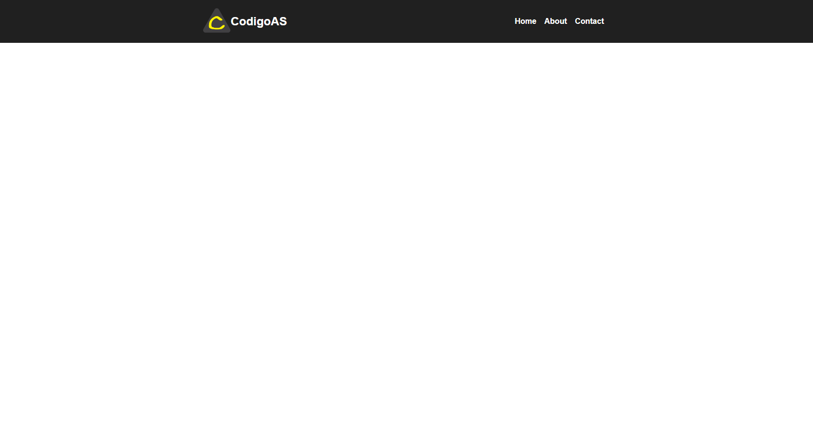

# Basic Header

This is a basic header, this small project is created on HTML and CSS

# Screen Project



# HTML
```html
<!DOCTYPE html>
<html lang="en">

<head>
    <meta charset="UTF-8">
    <meta http-equiv="X-UA-Compatible" content="IE=edge">
    <meta name="viewport" content="width=device-width, initial-scale=1.0">
    <title>Basic Header</title>
    <link rel="shortcut icon" href="favicon.png" type="image/x-icon">
    <link rel="stylesheet" href="styles.css">
</head>

<body>
    <header>
        <a class="logo">
            
            <h2>AaronSalinas</h2>
        </a>
        <nav>
            <a href="" class="link">Home</a>
            <a href="" class="link">About</a>
            <a href="" class="link">Contact</a>
        </nav>
    </header>
</body>

</html>
```

# CSS
```css
body{
    margin: 0;
    padding: 0;
    font-family: sans-serif;
    box-sizing: border-box;
}
a{
    color: white;
    text-decoration: none;
}
header{
    background-color: #202020;
    display: flex;
    justify-content: space-evenly;
    align-items: center;
    padding: 10px;
}
.logo img{
    padding-top: 7px;
    height: 50px;
    align-items: center;
}
.logo{
    display: flex;
    padding-right: 60px;
}
nav a{
    font-weight: 600;
    padding-right: 12px;
}
nav a:hover{
    color:yellow;
}
@media(max-width: 680px){
    header{
        flex-direction: column;
    }
    nav{
        padding: 10px 0px;
    }
}
```
# Visit my project with this url

